#Meanshift
##Table of Cotents
- Introduction
- Details and formula
- Applications
- Examples
- Reference

##Introduction
Mean shift is a procedure for locating the maxima of a density function given discrete data sampled from that function. It is useful for detecting the modes of this density.
##Details and formula
####Mean Shift Procedure:

Kernel density estimation:

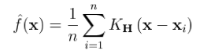</img>

BandWidth

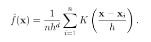</img>

BandWidth h can control the radius of influence of each data point. If h is too small, it overfits the data points; Too large: Smoothes out the details of the data.

At density maxima

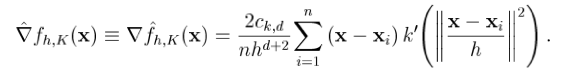</img>

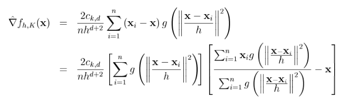</img>

Mean-shift Vector

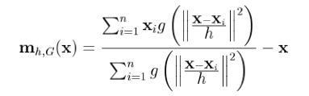</img>
 
##Applications
Two main applications of mean-shift procedure: Tracking and Segmentation.
###Segmentation
Spatial Radius and Range Radius

The color space <L,u,v> and <L,a,b> were especially designed to best approximate perceptually uniform color spaces.

An image is typically represented as a two-dimensional lattice of p-dimensional vectors (pixels), where *p*=1 in the gray level case, 3 for color images, and *p*>3 in the multispectral case.

The space of the lattice is known as the spatial domain while the gray level, color, or spectral information is represented in the range domain.For both domains an Euclidean metric is assumed. When the location and range vectors are concatenated in the joint spatial-range domain of dimension *d*=*p*+2, their different nature has to be compensated by proper normalization. Thus, the multivariate kernel is defined as the product of two radially symmetric kernels and the Euclidean metric allows a single bandwidth parameter for each domain.

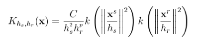

Steps:

1.	Run the mean shift filtering procedure for the image and store all the information about the d-dimensional convergence point in zi
2.	Delineate in the joint domain the clusters by grouping together all zi which are closer than hs in the spatial domain and hr in the range domain.
3.	For each i=1,...,n, assign Li according to zi's cluster.
4.	Eliminate spatial regions containing less than M pixels.

###Tracking
Mean Shift is an a non-parametric feature-space analysis technique. Through the mean shift iterations, it can find the target candidate that is most similar to a given target model.
The feature space chosen here are m-bin histograms, a low-complexity one. Thus,we have

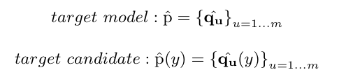

And we use

In order to perform the characteristic of target, we take
Epanechnikov kernel function to minimize the error. It is because, naturally, the pixels in the central area are more representative. Compared with the function in the opencv, the program with kernel function is more accurate.

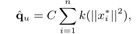

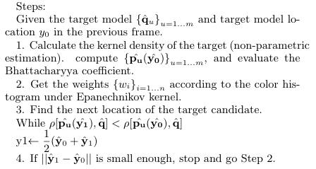

##Examples
###Segmentation
Take two pictures in Berkeley Dataset as follows:

<b>Original Picture 1</b>

<b>Result of Meanshift Segmentation</b>

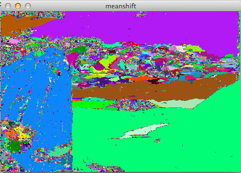

###Tracking

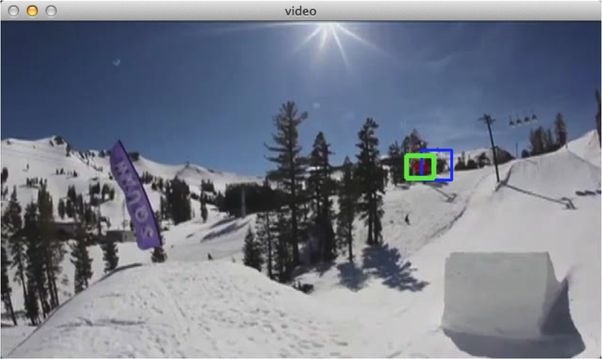

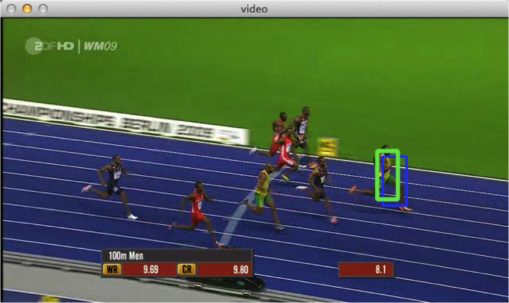

##Reference
[1]Comaniciu D, Meer P. Mean shift: A robust approach toward feature space analysis[J]. Pattern Analysis and Machine Intelligence, IEEE Transactions on, 2002, 24(5): 603-619.

[2]Dorin Comaniciu, Visvanathan Ramesh, Peter Meer. Real-Time Tracking of Non-Rigid Objects Using Mean Shift. CVPR, 2000.

[3]Dorin Comaniciu, Visvanathan Ramesh, Peter Meer.Kernel-based object tracking. TPAMI, 2003.